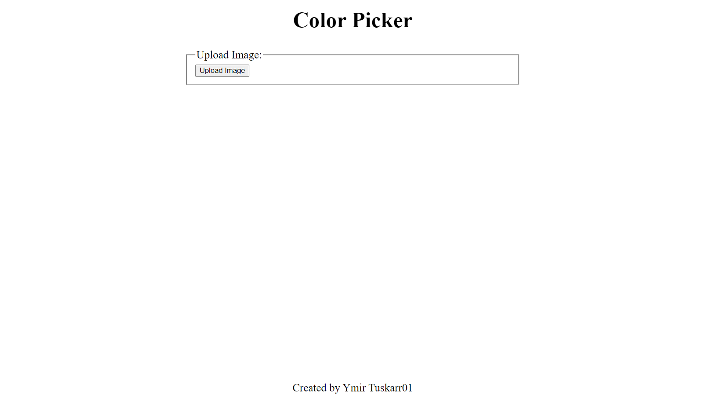
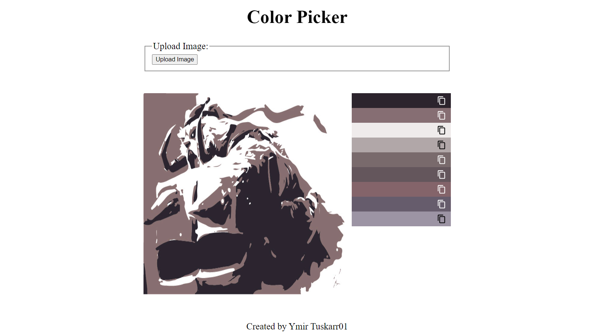

# color-picker

Live Demo:
https://ymirtuskarr01.github.io/color-picker

### Objectives
Build a color picker that can extract color from image

### Asset
- quantize.js by [nrabinowitz](https://gist.github.com/nrabinowitz/1104622) and [cwey](https://gist.github.com/cwey/6200071)
- toast by [Adam Argyle](https://web.dev/building-a-toast-component/)

### Reference
- [color-thief](https://github.com/lokesh/color-thief)
- [embed svg](http://xn--dahlstrm-t4a.net/svg/html/get-embedded-svg-document-script.html)
- [MutationObserver](https://developer.mozilla.org/en-US/docs/Web/API/MutationObserver)
- [copy to clipboard](https://stackoverflow.com/questions/400212/how-do-i-copy-to-the-clipboard-in-javascript)
- [convert image to Base64](https://stackoverflow.com/questions/6150289/how-can-i-convert-an-image-into-base64-string-using-javascript)

### Features
- produces palettes
- copy palette in (r,g,b) value